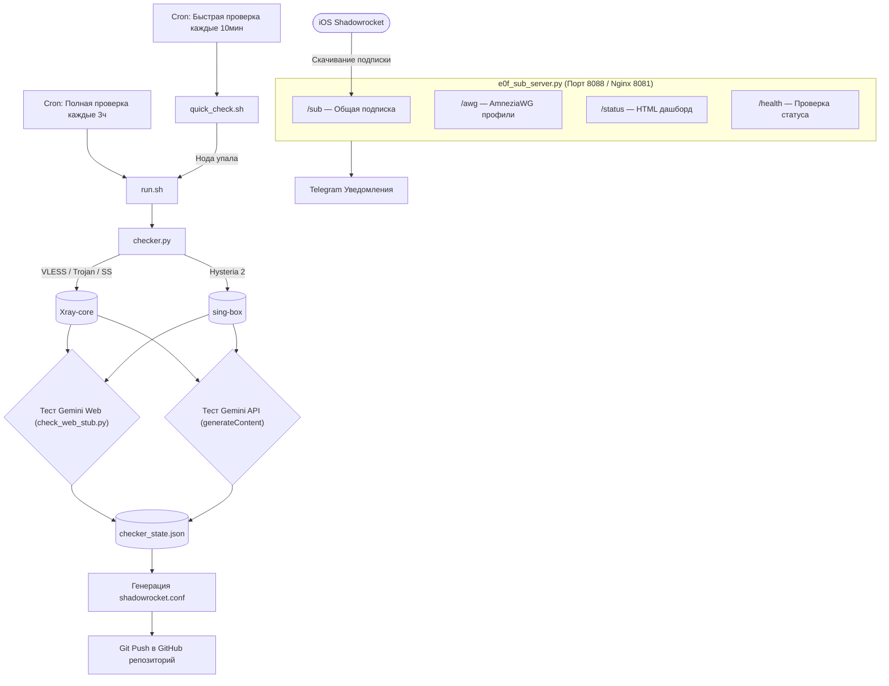

# 🛡️ Gemini Proxy Checker & Shadowrocket Config Generator

[](https://www.python.org/downloads/)
[](https://github.com/XTLS/Xray-core)
[](https://github.com/SagerNet/sing-box)
[](https://apps.apple.com/app/shadowrocket/id932747118)
[](LICENSE)

Автоматизированный комплекс для глубокого тестирования доступности **Google Gemini** (Web-интерфейс и официальный Gemini API) через цепочки современных прокси-протоколов (**VLESS Reality/XTLS**, **VMess**, **Trojan**, **Shadowsocks**, **Hysteria 2**).

Сервис динамически генерирует оптимизированный конфигурационный файл для **Shadowrocket** (`shadowrocket.conf`), автоматически публикует его в GitHub-репозиторий при изменении рабочих узлов, управляет AmneziaWG (AWG) подписками от **e0f.cx** и предоставляет веб-панель мониторинга в реальном времени.

---

## ✨ Основные возможности

1. **Глубокая двухуровневая проверка Google Gemini**:
   - **Gemini Web (`gemini.google.com`)**: полноценная валидация ответа с проверкой на региональные заглушки (`check_web_stub.py`), исключающая ложноположительные срабатывания («Gemini isn't supported in your country»).
   - **Gemini API (`generativelanguage.googleapis.com`)**: отправка реального тестового запроса генерации контента к модели `gemini-2.5-flash` через проверяемый прокси.
2. **Мультипротокольность**:
   - Встроенная оркестрация ядрами **Xray-core** (VLESS Reality, VMess, Trojan, Shadowsocks) и **sing-box** (Hysteria 2) с динамическим выделением локальных портов для параллельного тестирования.
3. **Автоматическая синхронизация с Shadowrocket**:
   - Формирование единого конфигурационного файла `shadowrocket.conf` с настроенными группами серверов, тестами задержки и правилами маршрутизации (DIRECT, PROXY, REJECT).
   - Автоматический коммит и `git push` в удалённый репозиторий только при реальном изменении списка рабочих серверов.
4. **Управление AmneziaWG подписками (`e0f_sub_server.py`)**:
   - Автоматическая интеграция с API провайдера **e0f.cx**.
   - Управление профилями пользователей с выделением уникальных AmneziaWG (AWG) конфигураций.
   - Дисковое кэширование профилей (`profile_cache.json`): сервис мгновенно готов к раздаче подписок даже при перезагрузке сервера или сетевых задержках e0f API.
   - Эндпоинты `/sub` (общая подписка) и `/awg` (персональные AmneziaWG файлы).
5. **Умный двухуровневый планировщик (Smart Cron)**:
   - **Полный цикл** (`run.sh`): каждые 3 часа запускает проверку всех серверов подписки.
   - **Быстрый мониторинг** (`quick_check.sh`): каждые 10 минут проверяет исключительно текущие активные серверы. Если хотя бы один узел отвалился — мгновенно инициируется полный цикл проверки и отправляется алерт в Telegram.
6. **Веб-панель мониторинга (`/status`)**:
   - Стильный минималистичный дашборд в тёмной теме:
     - Цветовые индикаторы статуса (Web / API) для каждого прокси-узла.
     - Таймер обратного отсчёта до следующего запланированного запуска проверки.
     - Сводка по серверам в подписках.
     - История последних 48 проверок с детализацией.
     - Автообновление каждые 60 секунд.
7. **Nginx Reverse Proxy & Защита**:
   - Ограничение частоты запросов (`limit_req`) для защиты подписок от перегрузки.
   - Security-заголовки (`X-Content-Type-Options`, `X-Frame-Options`).
   - Эндпоинт проверки здоровья `/health`.

---

## 🏗 Архитектура



---

## 📁 Структура проекта

```text
/opt/gemini-proxy-checker/
├── checker.py             # Основной движок проверки узлов (Xray + sing-box) для Gemini
├── check_web_stub.py      # Модуль детекции региональных заглушек Google
├── e0f_sub_server.py      # Сервер подписок e0f.cx, AWG генератор и веб-дашборд
├── quick_check.sh         # Скрипт быстрого мониторинга активных серверов
├── run.sh                 # Оркестратор полного цикла и git-синхронизации
├── shadowrocket.conf      # Сгенерированный актуальный конфиг для Shadowrocket
├── .env.example           # Пример конфигурационного файла
├── .gitignore             # Исключение секретов, локальных кэшей и временных файлов
└── README.md              # Документация проекта
```

---

## 🚀 Установка и развёртывание на VPS

### 1. Системные зависимости
```bash
sudo apt-get update && sudo apt-get install -y nginx python3 python3-venv git curl
```

### 2. Установка ядер Xray-core и sing-box
```bash
# Установка Xray-core
bash -c "$(curl -L https://github.com/XTLS/Xray-install/raw/main/install-release.sh)"

# Установка sing-box (для поддержки Hysteria 2)
bash -c "$(curl -fsSL https://sing-box.app/deb-install.sh)"
```

### 3. Клонирование и настройка виртуального окружения
```bash
git clone git@github.com:teddyxanya/Gemini-Proxy-Checker.git /opt/gemini-proxy-checker
cd /opt/gemini-proxy-checker

python3 -m venv venv
source venv/bin/activate
pip install requests pyyaml python-dotenv
```

### 4. Настройка конфигурации (`.env`)
Скопируйте пример файла конфигурации:
```bash
cp .env.example .env
nano .env
```

Заполните ваши параметры:
* `SUB_URL`: ссылка на исходную подписку провайдера (VLESS, VMess, Trojan, SS, Hysteria2).
* `GEMINI_API_KEY`: API-ключ Google AI Studio.
* `EOF_TOKEN`: Bearer токен авторизации в e0f.cx.
* `SECRET_TOKEN`: секретный ключ по умолчанию для получения подписки.
* `TELEGRAM_BOT_TOKEN`, `TELEGRAM_CHAT_ID`, `TELEGRAM_OWNER_ID`: данные вашего бота для алертов.
* `GIT_REPO_URL`: ссылка на ваш GitHub-репозиторий для авто-пуша `shadowrocket.conf`.

---

## ⚙️ Настройка Systemd и Nginx

### 1. Nginx Reverse Proxy (`/etc/nginx/sites-available/gemini-checker`)
```nginx
limit_req_zone $binary_remote_addr zone=sub:10m rate=10r/m;

server {
    listen 8081;
    server_name _;

    add_header X-Content-Type-Options nosniff;
    add_header X-Frame-Options DENY;

    # Веб-страница статуса
    location = /status {
        proxy_pass http://127.0.0.1:8088/status;
        proxy_set_header Host $host;
        proxy_set_header X-Real-IP $remote_addr;
        proxy_set_header X-Forwarded-For $proxy_add_x_forwarded_for;
        proxy_set_header X-Forwarded-Proto $scheme;
    }

    # Health check
    location = /health {
        proxy_pass http://127.0.0.1:8088/health;
        proxy_set_header Host $host;
        proxy_set_header X-Real-IP $remote_addr;
    }

    # Эндпоинты подписок с ограничением частоты
    location ~ ^/(sub|awg)$ {
        limit_req zone=sub burst=5 nodelay;
        proxy_pass http://127.0.0.1:8088;
        proxy_set_header Host $host;
        proxy_set_header X-Real-IP $remote_addr;
        proxy_read_timeout 30s;
    }

    location / {
        proxy_pass http://127.0.0.1:8088;
        proxy_set_header Host $host;
        proxy_set_header X-Real-IP $remote_addr;
        proxy_read_timeout 30s;
    }
}
```

Активируйте конфигурацию и перезапустите Nginx:
```bash
sudo nginx -t && sudo systemctl reload nginx
```

### 2. Сервис сервера подписок (`/etc/systemd/system/e0f-sub.service`)
```ini
[Unit]
Description=e0f.cx Private AWG Subscription Daemon
After=network.target

[Service]
Type=simple
User=root
WorkingDirectory=/opt/gemini-proxy-checker
ExecStart=/opt/gemini-proxy-checker/venv/bin/python3 /opt/gemini-proxy-checker/e0f_sub_server.py
Restart=always
RestartSec=5

[Install]
WantedBy=multi-user.target
```

Запустите сервис:
```bash
sudo systemctl daemon-reload
sudo systemctl enable --now e0f-sub
```

### 3. Расписание Cron (`crontab -e`)
```cron
# Полная проверка всех узлов каждые 3 часа
0 */3 * * * /opt/gemini-proxy-checker/run.sh >> /var/log/gemini-proxy-checker.log 2>&1

# Быстрый мониторинг активных серверов каждые 10 минут
*/10 * * * * /opt/gemini-proxy-checker/quick_check.sh >> /var/log/gemini-quick-check.log 2>&1
```

---

## 🔗 Связанные проекты

* 🎵 **[music-tg-bot](https://github.com/teddyxanya/music-tg-bot)** — Автономный Telegram-бот для поиска, скачивания музыки в 320 kbps (с обходом 403 и возрастных ограничений YouTube, SoundCloud фоллбэком) и интеграцией с Shazam через Apple Быстрые команды.

---

## 📄 Лицензия

MIT License © 2026 teddyxanya
